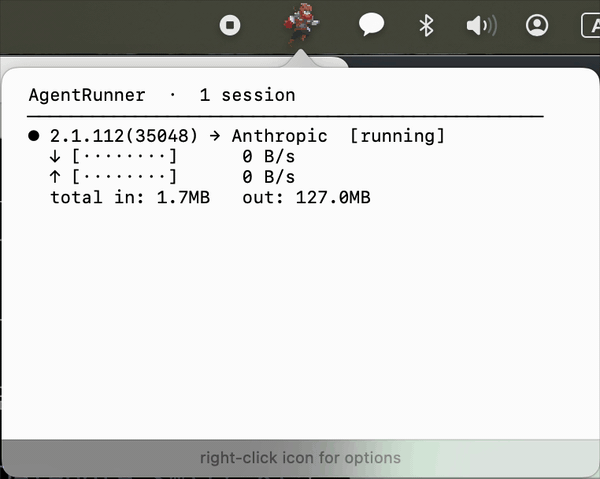

# AgentRunner

**A tiny pixel hero who fights for you — your hard-working AI agent, live on your menu bar.**


### Demo



> _23-second walkthrough — character reacting to live agent traffic._

You know [RunCat](https://kyome.io/runcat/), the cat that lived in your computer? In the AI agent era — meet the pixel hero who runs and fights for you, instead of reacting to your CPU.

You fire up Claude Code, Codex, Cursor, or your own agent loop. While you're focused on something else, the agent doesn't stop — thinking, calling tools, planning, writing code. And we want to *see* what the agent is doing.

There are beautiful projects that visualize multi-agent work like a video game. They're fun, but they devour CPU and RAM, and you can't keep that giant window up all the time. What we actually want is dead simple — **is the agent working hard right now, or not?** That's it.

**AgentRunner** — a 16-pixel adventurer lives on your menu bar, showing in one glance how hard your agent is grinding for you. He scouts when the agent is thinking, sprints when tokens stream, wields a sword when tools fire. The faster the response, the faster he runs. Sustained sessions trigger combos. Long marathon sessions trigger ultimates. Only after the agent has been quiet for thirty seconds does he finally lie down for a breather.

---

## How it works

AgentRunner watches outbound **network traffic** to known LLM API endpoints via macOS `nettop`. It maps bytes-per-second to character state and animation speed:

- **Lightweight** — `nettop` is a single OS-level subprocess that watches every session at once. CPU < 1%.
- **Accurate** — LLMs run over an API, so the network traffic *is* the ground truth of activity. No heuristics, no guessing.
- **Tool-agnostic** — Claude Code, Codex, Cursor, custom loops, brand new LLM APIs — register the host and you're done. No SDK integration.
- **Zero dependencies** — No proxy, no certificate, no permissions, no in-process hooks. Drop the app in `/Applications` and it works.
- **Privacy-safe** — Sees only the remote hostname and bytes-per-second. Never your prompts, responses, or API keys.

---

## Animations

| Preview                              | Name        | Trigger                                                     |
|:------------------------------------:|:-----------:|:----------------------------------------------------------- |
|           | `idle`      | No traffic (or stuck — indistinguishable from no traffic)   |
|           | `rest`      | Idle for 30+ seconds                                        |
|           | `jump`      | Traffic detected (new task starting)                        |
|     | `run`       | Traffic continues; speed scales with volume                 |
|   | `scout`     | Up to 15s after the stream pauses                           |
|     | `wield`     | Wind-down step — transitions to idle after 15s of scout     |
|  | `three-hit` | Fires after 10s+ of sustained running, then again every 10s |
|     | `supreme`   | An ultimate move — sometimes appears instead of three-hit   |

---

## Supported providers

Out of the box, AgentRunner detects traffic to the official API endpoints of these 11 providers. Hostnames are resolved to IPs via DNS, so any traffic to those IPs is matched automatically.

| Provider       | Hosts                                                              | Notes                                         |
|:-------------- |:------------------------------------------------------------------ |:--------------------------------------------- |
| **Anthropic**  | `api.anthropic.com`                                                | Claude API (powers Claude Code)               |
| **OpenAI**     | `api.openai.com`                                                   | ChatGPT / GPT-4 / o-series (powers Codex CLI) |
| **Google**     | `generativelanguage.googleapis.com`<br>`aiplatform.googleapis.com` | Gemini API + Vertex AI                        |
| **OpenRouter** | `openrouter.ai`                                                    | Multi-provider routing gateway                |
| **xAI**        | `api.x.ai`                                                         | Grok                                          |
| **DeepSeek**   | `api.deepseek.com`                                                 | DeepSeek-V / R series                         |
| **Cohere**     | `api.cohere.com`                                                   | Command series                                |
| **Mistral**    | `api.mistral.ai`                                                   | Mistral / Codestral                           |
| **Groq**       | `api.groq.com`                                                     | LPU inference (low-latency)                   |
| **Together**   | `api.together.xyz`                                                 | Open-source model hosting                     |
| **Perplexity** | `api.perplexity.ai`                                                | Sonar series                                  |

Hosts are resolved via `dig` at startup and re-cached every 10 minutes, so CDN / Anycast IP rotation is handled automatically.

---

### User configuration (custom endpoints & toggles)

Want to add a private gateway, a proxy endpoint, or your company's internal LLM gateway? Or disable providers you don't use? Edit the config file directly.

**1. Open the config**

Right-click the menu bar character → **Open Providers Config…**. Your default `.jsonc` editor (VS Code, Cursor, etc.) opens this file:

```
~/Library/Application Support/AgentRunner/providers.jsonc
```

On first launch, AgentRunner writes a seed file with the 11 default providers and inline comments. Your edits are preserved across app updates.

**2. File format (JSONC)**

Standard JSON plus `//` line comments, `/* ... */` block comments, and trailing commas. Example:

```jsonc
{
  "providers": [
    // Built-in — fields: name / hosts
    {"name": "Anthropic", "hosts": ["api.anthropic.com"]},
    // {"name": "OpenAI", "hosts": ["api.openai.com"]},   // comment out the whole line to disable

    // Add your own — internal gateway
    {"name": "MyCompany", "hosts": ["llm.internal.corp", "ai-gw.corp.net"]},

    // OpenAI-compatible proxies (LiteLLM, Helicone, etc.)
    {"name": "LiteLLM", "hosts": ["litellm.example.com"]},
  ]
}
```

**3. Field reference**

| Field   | Type     | Description                                                                                                |
|:------- |:-------- |:---------------------------------------------------------------------------------------------------------- |
| `name`  | string   | Display name in the popover. On duplicate IPs, the first match wins.                                       |
| `hosts` | string[] | FQDN only (e.g. `api.foo.com`). `https://`, ports, and paths are stripped. Multiple hosts per provider OK. |

> To disable a provider you don't use, comment out its entire line with `//`.

**4. Apply changes**

After saving, right-click the menu bar character → **Reload Providers** or hit **⌘R** for instant reload (no app restart). On a syntax error, AgentRunner falls back to the 11 seed providers and logs the error to `Console.app`.

**5. How do I find a host?**

Check the provider's official API docs for the base URL, or run `nettop -P -m tcp -L 1` while your agent is active and look for unfamiliar hostnames — add whichever domain shows up.

---

## Install

> Requires macOS 13 (Ventura) or later. Apple Silicon and Intel both supported.

1. Download the latest `AgentRunner-x.y.dmg` from [Releases](https://github.com/ww-w-ai/AgentRunner/releases).
2. Open the DMG → drag `AgentRunner.app` into `/Applications`.
3. **First launch — bypass Gatekeeper** (one time only). The app isn't yet notarized with a paid Apple Developer ID, so macOS blocks the first launch:
   - **macOS 13–14 (Ventura/Sonoma):** Right-click `AgentRunner.app` → **Open** → confirm.
   - **macOS 15+ (Sequoia):** Double-click → you'll see a "blocked" dialog → click **Done**. Then go to **System Settings → Privacy & Security**, scroll to the bottom, and click **Open Anyway** next to the AgentRunner entry → confirm with password.
   - **Terminal one-liner (any version):**
     ```bash
     xattr -dr com.apple.quarantine /Applications/AgentRunner.app
     ```
4. Look for the pixel character in your menu bar (top-right). Right-click for settings, left-click for active sessions.

Subsequent launches just work.

### Alternative: Homebrew

For CLI-friendly users who prefer `brew upgrade` over manual download:

```bash
brew tap ww-w-ai/tap
brew install --cask agentrunner
```

Brew strips the quarantine attribute, but Sequoia's notarization check still triggers, so the **Privacy & Security → Open Anyway** step above is still required on first launch.

To upgrade later:
```bash
brew update
brew upgrade --cask agentrunner
```

---

## Menu

No window, no extra UI. Everything lives behind a right-click on the character (RunCat-style):

- **Check for Updates…** — auto-checks against GitHub Releases (1h cache)
- **Launch at login** — toggle (uses macOS standard `SMAppService`)
- **Animation Guide…** — opens this README's animations section
- **Open Providers Config…** — opens `providers.jsonc` in your default editor
- **Reload Providers** — apply config changes without restart
- **About AgentRunner**
- **Quit AgentRunner**

Left-click opens a popover showing active sessions (one row per LLM stream).

---

## Performance

AgentRunner is built to be a **zero-distraction peripheral**. Targets, idle:

- CPU: **< 1%**
- Memory: **~25–30 MB**
- Battery impact: pauses on system sleep, resumes on wake

If you ever see it climb above that, file an issue.

---

## Credits

Pixel art by [rvros — Animated Pixel Hero (Adventurer)](https://rvros.itch.io/animated-pixel-hero), used under the asset's terms.

Inspired by [RunCat](https://kyome.io/runcat/) by Takuto Nakamura.

---

## License

Apache License 2.0. See [LICENSE](LICENSE) for the full text.
